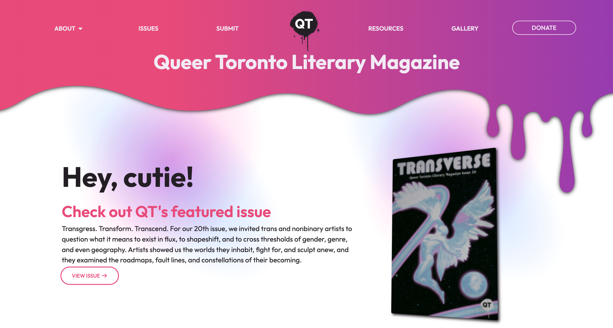

# Portfolio

## Software Development

I focus on freelance software development and consulting contracts for community and non-profit organizations. 

### Queer Toronto Literary Magazine

Since August 2025, I have worked with QT Mag, a queer literary and art publication based in Toronto, Ontario, Canada, to upgrade their website to a modern, responsive layout that can provide an engaging avenue for patrons to view the works publicized in QT Magazine issues

While the code is closed source, the updated project is live at [qtmag.ca](https://qtmag.ca)

### Textile Magazine

## Music Production & Publication

I distribute music under the moniker `nothing we do matters` on [Bandcamp](https://nothingwedomatters.bandcamp.com/) and [Subvert.fm](https://alpha.subvert.fm/nothing-we-do-matters)

The project's first EP, `kinematics of machinery`, a three-track amuse-oreille, was released on February 28th, 2026
